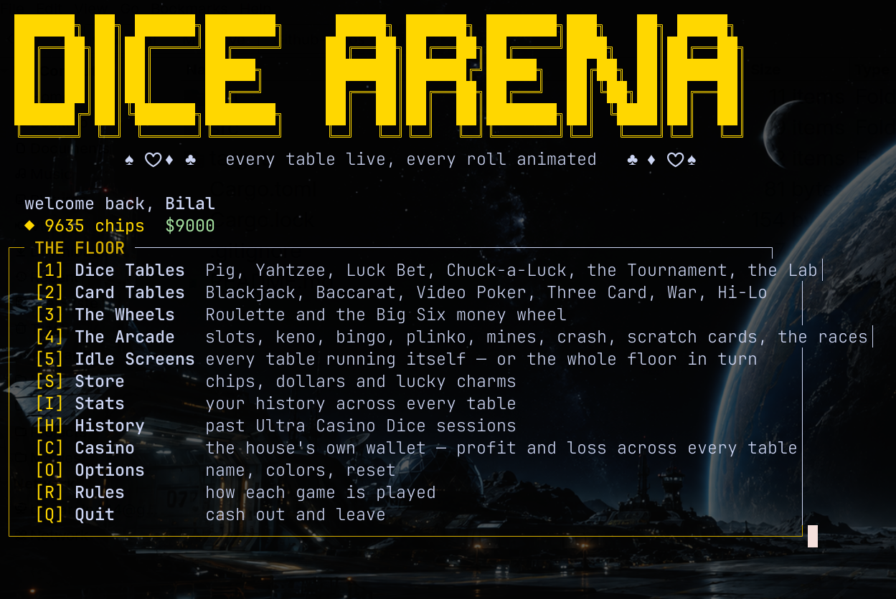

# Dice Arena  -  Built with Claude AI

A casino console in Rust — **zero external crates**, including its own PRNG
and its own raw-terminal input (direct `termios(3)` FFI, no `crossterm`).
Twenty-four tables across four rooms, every one of them animated, and every
one of them able to run itself with nobody watching.

```
cargo run --release

```



## Controls

Every screen in the app is driven by **single keypresses** — there is no
typing a letter and pressing Enter. The terminal is put into raw,
no-echo mode on launch, so the instant you press a key it acts:

- Menus and in-game choices: press the bracketed key shown, e.g. `[R]oll`,
  `[1] Pig`, `[Y]es` — the action fires immediately.
- Numeric pickers (a target score, a chip stake): `↑/→` and `↓/←` step the
  value, digits type an exact number, and any preset keys shown (like
  `[M]` for all-in) jump straight there. `Enter` confirms, `Esc` cancels —
  these are the only two places Enter is used, since there's no way to
  know a typed number is "done" without a terminator.
- Anywhere a name is typed (yours, a second human player's), type and
  press `Enter` to confirm.
- `Ctrl+C` leaves the table/menu you're in immediately and cleanly closes
  the app, saving as it goes.
- Crash is the one table where a key matters *during* the animation: `C`
  cashes out mid-climb. Everything else settles between frames.
- On any idle screen, `Q` returns you to the floor.

The whole app runs in the terminal's alternate screen buffer, so nothing
scrolls into your shell's history — every screen is a hard clear-and-redraw,
and your prompt looks exactly as it did before you ran it once you quit.

## The floor

Two dozen tables will not fit on one readable menu, so the floor is grouped
the way a real one is. The dashboard opens four rooms, plus the idle
screens, the Store, your Stats, the Casino's own books and the Rules.

### Dice tables

| | |
|---|---|
| **Pig** | Press-your-luck race to a target score. 2–6 players, any mix of humans and bots, classic (1d6) or two-dice variant (snake eyes wipes your score, doubles pay double). |
| **Yahtzee** | Full 13-category scorecard, three rolls a turn with dice holding (press 1-5 to toggle a hold, `R` to reroll, `S` to stand), upper-section 63/35 bonus, 100-point bonus Yahtzees. 1–4 players, hot-seat or vs. AI. |
| **Luck Bet** | Eight dice named **A–H**. Up to three players each back a letter and the face they think it lands on. A hit pays 5:1 (6:1 with a VIP pass); a miss loses the stake and rakes a fifth of it into a carried-over jackpot. Hit your number while three or more dice show it and you sweep the jackpot too. |
| **Luck Bet: Turbo** | The identical game, hands-free. One key spins the table at 20 frames a second for three seconds before it settles; bets repeat automatically. |
| **Chuck-a-Luck** | Three-dice wagering. Bet a face (1:1/2:1/3:1 by how many show it), HIGH/LOW at evens, or any triple at 30:1. |
| **Tournament** | Chip buy-in, single-elimination Pig bracket (4 or 8 entrants, three tiers). Your matches are played out, the rest of the bracket is simulated. Champion takes 70% of the pool, runner-up 30%. |
| **Dice Lab** | Roll any `NdM+K` (`3d6`, `d20`, `4d10+2`), plot a distribution with `sim 2d6 50000`, and pin the RNG with `seed 42`. The one screen that still takes typed text — there's no sensible key for an arbitrary expression. |
| **Ultra Casino Dice** | An unattended spectacle table — 12 dice, 8 computer players, 10 rounds, zero input required. Every round each seat backs a letter and calls a face, the table spins for a full 7 seconds, and whoever called it right splits the pot — losers' stakes are exactly what winners collect, with one exception: a round nobody calls right pays its whole pot to the house. Seats stay or cash out between rounds, and anyone who leaves is replaced. Every round and every session lands in the **History** screen. |

### Card tables

All six deal from one shared deck, shoe and set of hand rankings
(`src/games/cards.rs`).

| | |
|---|---|
| **Blackjack** | Heads-up against the dealer with a real 52-card shoe. Hit, stand, or double down; dealer stands on all 17s; blackjack pays 3:2. |
| **Baccarat** | Back the player, the banker or the tie, then watch a hand nobody makes a decision in — the third-card rules are fixed, and they're the real ones. Player and banker pay 1:1, the banker less a 5% commission; the tie pays 8:1 and pushes the other two. |
| **Video Poker** | Jacks or better. Five cards, hold any of them, draw once. A pair only pays from jacks up; from there it climbs to a royal flush at 800:1. |
| **Three Card Poker** | Ante, look at three cards, then fold or match your ante to play on. The dealer needs queen high to play at all — when they can't, your ante pays and the play bet comes back. A straight, trips or straight flush pays an ante bonus win or lose. In the three-card game a straight beats a flush. |
| **Casino War** | High card wins, even money. On a tie, surrender for half your ante or go to war: match it, burn three, deal again. Win the war and the raise pays even money while the ante pushes; tie again and the raise pays 2:1. |
| **Hi-Lo** | Call the next card higher or lower. Every call is priced off its true odds less a small margin, so calling higher on a two is nearly free and calling higher on a king pays richly. Cash out whenever — one wrong call takes the lot. |

### The wheels

| | |
|---|---|
| **Roulette** | Single-zero wheel. Straight-up numbers pay 35:1; red/black, odd/even, high/low pay evens; the three dozens pay 2:1. |
| **Big Six** | The money wheel: 54 segments running past a fixed pointer, decelerating into their stop. Back the 1 (24 segments, 1:1) through to the joker or the house star (one segment each, 40:1). The landing segment is drawn first and the scroll is worked backwards from it, so what you watch is genuinely what you get. |

### The arcade

| | |
|---|---|
| **Slots** | Three weighted reels stopping left to right on one payline. The reels are real strips — each symbol appears as many times as its weight — so the odds are visible in the code rather than hidden in a constant. Three of a kind pays 8x to 120x; loose sevens pay on their own. |
| **Keno** | Cover 1–10 spots on an eighty-number board; twenty balls come out one at a time. Cover one and a single hit pays 3x; cover ten and you need five before anything pays — but all ten pays 10,000x. |
| **Bingo** | A 75-ball card with a free centre. Forty balls are called and the payout is on *how fast* your first line lands: 30x by ball 15, down to your stake back by ball 40. Flat-rate bingo would hand the building over — a line inside forty balls turns up nearly half the time. |
| **Plinko** | Drop a ball through twelve rows of pegs into thirteen slots. Low, medium and high risk change how sharply the prizes climb toward the edges — up to 220x — but all three return the same share of your stake. |
| **Mines** | Choose how many mines hide under twenty-five tiles, then turn them over one at a time. Each safe tile raises the multiplier by the true odds of having got that far. Cash out whenever; find a mine and the round is gone. |
| **Crash** | A multiplier climbs from 1.00x and stops dead at a point drawn before the round starts. Press `C` to take the money first. The chance of surviving to any multiplier is 0.99 divided by it. |
| **Scratch Cards** | Nine panels, three of a kind pays. The prize is decided when the card is pressed and the panels are laid out to show it — exactly how a real scratch card works, and why the return to player is an exact number rather than an estimate. |
| **Horse Racing** | Six runners at fixed odds from 2:1 to 20:1. The odds come first and each runner's chance is derived from them, so every horse returns the same share of your stake. The winner is drawn before the tapes go up and the race is run to it. |

### Store

Exchange in-game dollars for chips (10 per $1) and back (12 chips per $1),
and buy reroll tokens, insurance chits, lucky charms, a VIP pass or a gold
dice skin.

## The roll

Every dice reveal in the app plays the same house animation: ten frames of
tumbling values over roughly a second, easing from a quick flicker to a
settle, before landing on the real, already-determined result. Ultra Casino
Dice's table spins to its own longer rhythm — 20 frames a second for a full
7 seconds. Every other table has its own: reels stop left to right, the
money wheel decelerates into its pointer, a plinko ball accelerates as it
falls, keno balls speed up as the board fills, and a crash curve tightens
exactly as the decision gets harder.

Nothing is deco:rative. Where an outcome is drawn before the animation runs —
the wheel's segment, the race winner — the animation is worked backwards
from that result so what you watch is what you get.

### Dice and card sizing

Faces draw at the largest of three sizes that fits the live terminal:
**27×15 for a die and 21×15 for a card**, exactly three times the original
9×5 and 7×5, with a middle step between. Nothing in a game picks a size —
the renderers measure the window and take the biggest that fits, so
Chuck-a-Luck's three dice fill the screen while Ultra Casino Dice's twelve
fall back gracefully on the very same terminal. A big card fills its face
with its suit drawn as block art.

## Idle screens

Every wagering table can be left running itself: fictional punters place
their own bets, the full animation plays, and results scroll by. Pick one
table from the **Idle Screens** menu, or choose *the whole floor* and the
casino cycles all seventeen in turn, a slot each, with a title card between
them. `Q` returns you to the floor from anywhere in it.

Nothing an idle screen does touches your wallet or the house ledger — every
chip on those screens is fictional twice over.

## Economy

Chips are the table currency, dollars are the in-game cash — **all of it
fictional**, with no real money involved anywhere. One shared wallet spans
every wagering game and persists between sessions. Go broke and the house
stakes you again, so no table is ever a dead end.

### The house

The casino keeps a wallet too. Every time a wagering game settles, the
house's balance moves by exactly the opposite of whatever the player's
wallet just did, so the two ledgers are always mirror images of each other.
Store currency exchanges, item purchases and anything an idle screen does
don't touch it: those move chips around, but they aren't a game's outcome.
The **Casino** screen (`[C]` on the dashboard) shows the running balance,
lifetime collected/paid totals and a per-table breakdown; the same per-table
numbers appear as a `house_pl` line under each game on the **Stats** screen.

## Architecture

The UI is a separate layer (`src/ui/`) from every game's rules — a new game
only ever needs a `Ctx` (RNG + save file + `Screen`) and the widgets in
`src/ui/`. That's what let fourteen new tables land as fourteen new files
that touch nothing in the games that came before them.

- `src/ui/input.rs` — raw single-keypress terminal input (direct termios
  FFI on Unix; a line-buffered fallback elsewhere), plus the non-blocking
  polls that let an animation notice a keypress without stalling on one.
- `src/ui/mod.rs` — the `Screen` (alternate-screen session, buffered
  clear-and-redraw frames) and `Scale`, the shared sizing used by both
  renderers.
- `src/ui/theme.rs` — the casino color palette.
- `src/ui/dice_art.rs` / `card_art.rs` — pip-face and playing-card
  rendering at three sizes, and the roll animation.
- `src/ui/menu.rs` / `widgets.rs` — the boxed keyed menu, the numeric
  stepper, text input, progress bars, banners.
- `src/games/*.rs` — pure game logic, one file per game, each drawing only
  through the `Ctx`/`Screen` it's handed.
- `src/games/cards.rs` — the shared deck, shoe and both hand rankings, so
  six card tables share one shuffle.
- `src/games/table.rs` — the four beats every wagering table has in common:
  restaking a broke player, taking a stake, settling against both wallets,
  and the play-again prompt. Also the idle-budget clock the floor cycler
  uses to time-slice tables that don't know they're being cycled.
- `src/games/floor.rs` — which tables exist, and the screensaver that walks
  them.
- `src/economy.rs` — `Wallet` (the player's chips, dollars and inventory)
  and `House`, the casino's mirror-image ledger, recorded explicitly at each
  game's settlement point rather than hooked generically into `Wallet`
  (which also handles Store exchanges that shouldn't count as winnings).
- `src/history.rs` — a plain-text, append-only log of Ultra Casino Dice
  sessions, kept separate from `stats::Store`'s `key=value` settings file
  since it only ever grows.

## Features

- ASCII pip faces and block-art card suits at three sizes, auto-fitted to
  the terminal, with colored output (toggleable in Options)
- Three AI difficulties — Easy is erratic, Normal holds at 20, Hard uses
  the near-optimal "hold at 25 minus banked" rule and pushes when behind
- Persistent stats, high scores and settings in
  `$XDG_DATA_HOME/dice_arena/save.conf`, plus a plain-text Ultra Casino
  Dice history log alongside it
- A live house ledger (`Casino` screen) tracking the casino's own profit
  and loss, mirror-image to the player's wallet, across every wagering table
- Idle/attract mode for every wagering table, plus a floor-wide screensaver
- Reproducible sessions: `DICE_SEED=42 cargo run`
- Persistent inventory: consumables (reroll, insurance, charm) and permanent
  upgrades (VIP payouts, gold dice)
- Handles EOF and Ctrl+C cleanly, so the whole app is scriptable

## Tests

```
cargo test
```

167 tests, covering dice-notation parsing, roll uniformity, seeded
reproducibility, every Yahtzee scoring category, Luck Bet hit/sweep
resolution, Roulette's payout table, Blackjack's hand totals, Ultra Casino
Dice's pot math, the house ledger's zero-sum invariant, and the render
geometry (every face and card is a perfect rectangle at every size, and the
big ones really are 3× the small ones).

Every new table's payout maths is pinned down against the odds it claims,
not just against itself:

- **Plinko** — all three risk profiles return 95–100% of stake, weighted by
  the real binomial odds of each slot.
- **Scratch Cards** — the print run adds up to exactly 98% return.
- **Horse Racing** — every runner on the card returns the same share.
- **Big Six** — every segment pays strictly less than its true odds.
- **Crash** — the survival curve matches `0.99 / x` at two sample points.
- **Hi-Lo** — every call is priced below fair odds, and mirrored calls match.
- **Mines** — the price never exceeds the fair reciprocal of the odds.
- **Bingo** — the speed paytable is checked against thousands of real cards.
